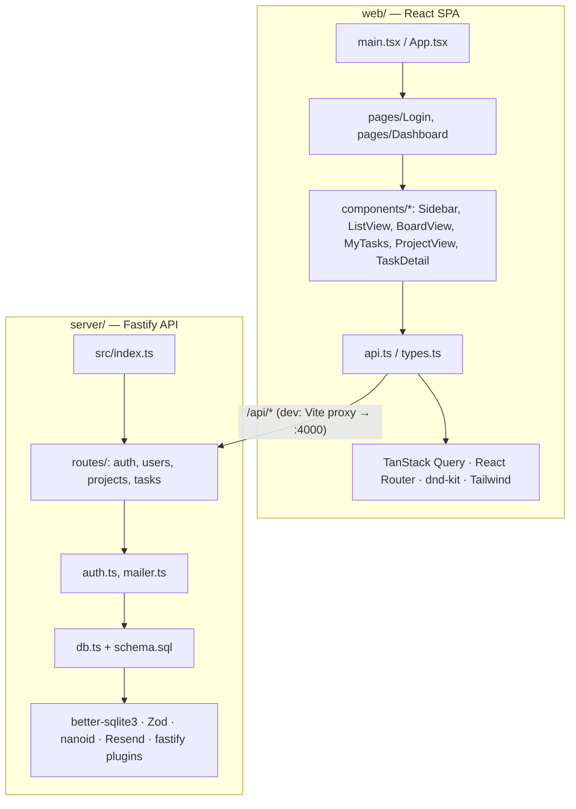

# Architecture Layer Stack

Generated by `/bootstrap-project` on 2026-05-11.

Family Asana is a two-package npm workspace: a Fastify/SQLite backend and a Vite/React frontend, talking over a `/api/*` HTTP surface.

## Layer Diagram

## Server Layer Map

| Layer | Path | Purpose |
|-------|------|---------|
| L0 — External deps | `server/package.json` | fastify, @fastify/{cors,cookie,helmet}, better-sqlite3, zod, nanoid, resend, dotenv, tsx, typescript |
| L1 — Config & env | `server/src/env.ts`, `server/.env.example`, `server/tsconfig.json` | Env parsing, `isDev` flag, PORT/HOST/SESSION_SECRET/RESEND_*/APP_URL/ALLOWED_EMAILS |
| L2 — Data layer | `server/src/db.ts`, `server/src/schema.sql` | better-sqlite3 instance, idempotent schema bootstrap (WAL + FKs ON), tables: users, magic_links, sessions, projects, tasks |
| L3 — Services / business logic | `server/src/auth.ts`, `server/src/mailer.ts` | Session + magic-link helpers, Resend send (or console-log fallback in dev) |
| L4 — Interface (routes) | `server/src/routes/auth.ts`, `users.ts`, `projects.ts`, `tasks.ts` | HTTP handlers, Zod request validation, response shaping |
| L5 — Entry point | `server/src/index.ts` | Registers helmet/cors/cookie, mounts `/api/{auth,users,projects,tasks}` + `/health`, listens |

## Web Layer Map

| Layer | Path | Purpose |
|-------|------|---------|
| L0 — External deps | `web/package.json` | react, react-dom, react-router-dom, @tanstack/react-query, @dnd-kit/{core,sortable}, clsx; vite, tailwindcss, postcss, autoprefixer |
| L1 — Config | `web/vite.config.ts`, `web/tailwind.config.js`, `web/postcss.config.js`, `web/tsconfig.json`, `web/index.html`, `web/src/index.css` | Vite + React plugin, `/api` and `/health` dev proxy → `:4000`, Tailwind setup |
| L2 — Data / types | `web/src/api.ts`, `web/src/types.ts` | fetch wrapper, shared API types (User, Project, Task) |
| L3 — Domain components | `web/src/components/Sidebar.tsx`, `ListView.tsx`, `BoardView.tsx`, `MyTasks.tsx`, `ProjectView.tsx`, `TaskDetail.tsx` | Reusable feature components; BoardView owns the dnd-kit Kanban |
| L4 — Pages | `web/src/pages/Login.tsx`, `web/src/pages/Dashboard.tsx` | Top-level route screens |
| L5 — Entry point | `web/src/main.tsx`, `web/src/App.tsx` | React root, QueryClientProvider, Router, `/login`, `/auth/verify`, `/*` (authed Dashboard) |

## Cross-cutting

- **Auth flow**: Login → `POST /api/auth/request-link` → email (or console log) → `GET /api/auth/verify?token=` sets session cookie → `GET /api/auth/me` confirms identity → frontend gates `/*` on the result.
- **API contract**: full surface in `docs/PHASE-1-SPEC.md`. Server is the source of truth; `web/src/types.ts` mirrors it by hand.
- **Drag-drop**: BoardView uses `@dnd-kit/core` for status changes (todo↔doing↔done↔blocked). Within-column reordering via `useSortable` is on the Phase 1 todo list.
- **Build → prod**: `npm run build` at root runs `server` tsc then `web` `tsc -b && vite build`. Prod plan: server serves `web/dist/` under `/` (not wired yet — see `docs/PHASE-1-SPEC.md`).
